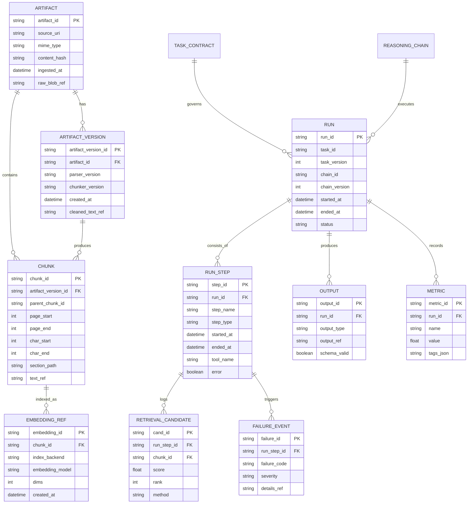

# Executable Harness Layer for a Wiki-Backed Agent

## Executive summary

An “executable harness layer” is the thin, explicit control plane that turns your wiki into a system that can reliably run tasks, not just answer questions. The harness is successful when it is more deterministic than the model: it constrains what the agent is allowed to do, how it retrieves evidence, how it validates outputs, and how it persists traces for debugging and improvement. The most practical way to make this executable is to keep the harness specs as parseable text (Markdown + YAML blocks) and build a small runtime that interprets those specs into a consistent pipeline: decompose, retrieve, execute, verify, persist. This matches the core RAG idea of pairing parametric generation with non-parametric memory (your wiki + artifacts) while preserving provenance. citeturn0search0turn0search4

This report gives you a minimal, rigorous harness you can implement quickly:

You will define three spec files, each fully machine-readable inside Markdown: `task_contracts.md` (what a task is, IO rules, budgets), `reasoning_chains.md` (step-by-step executable playbooks), and `failure_taxonomy.md` (the system’s canonical error ontology plus automated responses). By coupling those specs to structured model outputs (JSON Schema enforced at the API layer), you can keep control logic stable even as models change. citeturn5search0turn4search1turn5search12

Under the hood, the data model must separate raw artifacts (immutable, provenance-preserving) from cleaned/parsed representations (mutable, re-derivable), and it must persist run traces at a step granularity (retrieval candidates, tool calls, validation outcomes). This is aligned with standard observability concepts like traces/spans and attribute-rich logs, enabling monitoring and experiment-driven iteration. citeturn3search0turn3search4turn3search12

A minimal viable stack can be deployed in three tiers (simple, balanced, robust). The balanced tier is usually the best first “production-ish” target because it keeps artifacts and traces queryable without introducing distributed-systems overhead.

## Harness goals and success metrics

A harness exists to reduce variance: not to make the model smarter, but to make the system more predictable, inspectable, and transferable across models and retrieval backends. A useful framing is that RAG already splits “knowledge/grounding” (retrieval) from “language synthesis” (generation). The harness extends that split into an end-to-end execution contract with explicit verification and persistence, so you can debug and improve systematically. citeturn0search0turn2search2

Success metrics should be defined at four layers.

At the task layer, measure contract compliance: percentage of runs that produce schema-valid outputs, contain required fields, and meet completion conditions without manual edits. Using JSON Schema-based “structured outputs” makes this measurable because invalid outputs become hard failures, not silent corruption. citeturn5search0turn4search1

At the retrieval layer, measure “grounding quality” rather than just relevance. You want high context relevance and high answer faithfulness to retrieved context. Frameworks like RAGAs explicitly separate retrieval and generation quality signals (e.g., context relevance, faithfulness/groundedness), which maps cleanly onto harness-level checks. citeturn2search2turn2search6

At the orchestration layer, measure decomposition efficiency: number of spawned subtasks, average wall-clock latency, and cost per successful completion. Decomposition and deliberate search improve success on complex tasks, but they add branching cost; patterns like Plan-and-Solve and Tree-of-Thoughts show why and when structured planning/search help, and they motivate an explicit “spawn budget” in the harness. citeturn2search1turn2search0

At the reliability/operations layer, measure trace completeness and debuggability: percent of runs with full step traces, searchable retrieval candidates, and recorded failure codes. This follows standard tracing concepts (trace → spans → attributes) and enables monitoring and regression detection. citeturn3search0turn3search12

Recommended “minimum viable” metrics to implement first:

Contract compliance rate, retrieval hit rate (non-empty + above threshold), groundedness/faithfulness proxy (lightweight judge or rules), and median/95th percentile latency per task. The moment you cannot tell why a run failed from stored traces, the harness isn’t real yet.

## Harness specs and file formats

The harness should be model-agnostic: specs describe intent, constraints, and validation; the runtime binds them to whichever LLM and retriever you currently use. Declarative “programming rather than prompting” approaches like entity["organization","DSPy","lm programming framework"] are useful references here because they treat RAG/agent loops as composable modules rather than ad-hoc prompt strings. citeturn0search10turn0search6

The minimal spec approach below is intentionally boring: each file is Markdown, but the executable content is in fenced YAML blocks that your runtime can parse. YAML is chosen because it is human-editable and supports structured nesting.

### Schema rules shared by all three files

Each YAML block must include:

`kind` (enum), `id` (stable string), `version` (int), and `description` (string).

Every reference is by `(id, version)` or by `id` with “latest version wins” rule (your choice, but make it explicit in runtime).

Every step must log a trace entry keyed by `(run_id, step_id)`.

### Ready-to-run `task_contracts.md`

```markdown
# task_contracts.md

This file defines task IO, budgets, allowed tools, and which reasoning chain to execute.
Executable blocks are fenced YAML with kind: task_contract.

```yaml
kind: task_contract
id: wiki.answer_with_citations
version: 1
description: >
  Answer a user question using retrieved wiki context and citations.
inputs:
  user_query:
    type: string
    required: true
  user_context:
    type: object
    required: false
outputs:
  answer_markdown:
    type: string
    required: true
  citations:
    type: array
    required: true
    items:
      type: object
      required_keys: [chunk_id, artifact_id, quote, relevance_note]
budgets:
  max_model_calls: 4
  max_child_tasks: 2
  max_retrieval_k: 24
  max_wall_clock_seconds: 45
tools_allowed:
  - retriever.search
  - verifier.schema_validate
  - verifier.groundedness_check
  - store.persist_run
retrieval_profile:
  id: rag.hybrid_rrf
  min_score_threshold: 0.15
chain:
  id: chain.rag_answer
verification_profile:
  require_schema_valid: true
  require_min_citations: 2
  require_groundedness: true
persistence:
  store_prompts: true
  store_tool_io: true
  store_retrieval_candidates: true
  retention_days_full_trace: 30
completion_condition:
  all_of:
    - output.schema_valid == true
    - output.citations.count >= 2
    - verifier.groundedness.pass == true
```

```yaml
kind: task_contract
id: wiki.ingest_artifact
version: 1
description: >
  Ingest a raw artifact (pdf/html/md), extract cleaned text, chunk, embed, and index.
inputs:
  artifact_uri:
    type: string
    required: true
  artifact_type:
    type: string
    required: true
    enum: [pdf, html, md, txt]
outputs:
  artifact_id:
    type: string
    required: true
  chunk_ids:
    type: array
    required: true
budgets:
  max_model_calls: 2
  max_wall_clock_seconds: 120
tools_allowed:
  - parser.extract_text
  - chunker.hierarchical
  - embedder.embed
  - indexer.upsert
  - store.persist_artifact
chain:
  id: chain.ingest_and_index
verification_profile:
  require_nonempty_text: true
  require_min_chunks: 3
persistence:
  store_raw: true
  store_cleaned: true
  store_chunks: true
  retention_days_full_trace: 14
completion_condition:
  all_of:
    - output.artifact_id != ""
    - output.chunk_ids.count >= 3
```
```

This contract-first approach becomes materially stronger when paired with API-level schema enforcement for outputs and tool arguments. With structured outputs, you can enforce JSON Schema rather than hoping the model behaves. citeturn5search0turn5search1turn4search1

### Ready-to-run `reasoning_chains.md`

This file is the executable playbook library. It is where you encode patterns like “plan → retrieve → act,” which mirrors established agent paradigms like ReAct (interleaving reasoning and actions) and Plan-and-Solve (explicit plan before execution). citeturn0search1turn2search1

```markdown
# reasoning_chains.md

This file defines executable chains (step graphs). Each step emits a trace span.

```yaml
kind: reasoning_chain
id: chain.rag_answer
version: 1
description: >
  Plan, retrieve supporting spans, synthesize a claim plan, render citations deterministically, verify groundedness, then persist.
steps:
  - id: s1_plan
    type: llm
    output_schema:
      type: object
      required_keys: [query_intent, search_queries, must_answer, uncertainty_notes]
    prompt_template: |
      You are the harness planner.
      Task: answer the user query with citations.
      User query: {{user_query}}

      Produce:
      - query_intent: one sentence
      - search_queries: 3-6 short retrieval queries (strings)
      - must_answer: boolean (true unless impossible)
      - uncertainty_notes: list known unknowns
  - id: s2_retrieve
    type: tool
    tool_name: retriever.search
    tool_args_template:
      queries: "{{steps.s1_plan.search_queries}}"
      profile_id: "rag.hybrid_rrf"
      k: 24
      filter:
        doc_type: ["wiki_page", "notes", "pdf_extract"]
    outputs:
      retrieved_chunks: list
  - id: s3_synthesize
    type: llm
    input_bindings:
      context_chunks: "{{steps.s2_retrieve.retrieved_chunks}}"
    output_schema:
      type: object
      required_keys: [refusal, refusal_reason, claims]
    prompt_template: |
      Produce a claim plan using ONLY the provided context chunks.
      Do not write final prose or final citations.
      If context is insufficient, refuse.

      User query: {{user_query}}

      Context chunks (each has chunk_id, artifact_id, text):
      {{context_chunks}}

      Output:
      - refusal: boolean
      - refusal_reason: string
      - claims: array of objects:
          {claim_id, text, span_ids}
      Rules:
      - one claim must map to one supportable fact
      - avoid conjunctions unless every part is directly supported by the cited spans
      - avoid interpretive language unless the cited spans explicitly support it
  - id: s4_render_outputs
    type: tool
    tool_name: renderer.build_answer_and_citations
    tool_args_template:
      claim_plan: "{{steps.s3_synthesize}}"
      retrieved_chunks: "{{steps.s2_retrieve.retrieved_chunks}}"
  - id: s5_verify_groundedness
    type: tool
    tool_name: verifier.groundedness_check
    tool_args_template:
      answer_markdown: "{{steps.s4_render_outputs.answer_markdown}}"
      citations: "{{steps.s4_render_outputs.citations}}"
      retrieved_chunks: "{{steps.s2_retrieve.retrieved_chunks}}"
      policy: "strict_quote_match_or_semantic_entailment"
  - id: s6_persist
    type: tool
    tool_name: store.persist_run
    tool_args_template:
      task_id: "wiki.answer_with_citations"
      inputs:
        user_query: "{{user_query}}"
      outputs:
        answer_markdown: "{{steps.s4_render_outputs.answer_markdown}}"
        citations: "{{steps.s4_render_outputs.citations}}"
      trace:
        steps: "{{steps}}"
```

```yaml
kind: reasoning_chain
id: chain.ingest_and_index
version: 1
description: >
  Extract text, hierarchical chunk, embed, upsert, and persist provenance.
steps:
  - id: s1_extract
    type: tool
    tool_name: parser.extract_text
    tool_args_template:
      artifact_uri: "{{artifact_uri}}"
      artifact_type: "{{artifact_type}}"
    outputs:
      raw_text: string
      page_map: object
  - id: s2_chunk
    type: tool
    tool_name: chunker.hierarchical
    tool_args_template:
      text: "{{steps.s1_extract.raw_text}}"
      strategy: "parent_child"
      parent_tokens: 900
      child_tokens: 200
      overlap_tokens: 40
  - id: s3_embed
    type: tool
    tool_name: embedder.embed
    tool_args_template:
      chunks: "{{steps.s2_chunk.child_chunks}}"
      embedding_model: "default"
  - id: s4_upsert
    type: tool
    tool_name: indexer.upsert
    tool_args_template:
      embeddings: "{{steps.s3_embed.embeddings}}"
      metadata:
        artifact_uri: "{{artifact_uri}}"
        artifact_type: "{{artifact_type}}"
        chunk_strategy: "parent_child"
  - id: s5_persist
    type: tool
    tool_name: store.persist_artifact
    tool_args_template:
      artifact_uri: "{{artifact_uri}}"
      artifact_type: "{{artifact_type}}"
      raw_text: "{{steps.s1_extract.raw_text}}"
      chunks: "{{steps.s2_chunk.child_chunks}}"
      embeddings_ref: "{{steps.s4_upsert.index_refs}}"
```
```

Hierarchical chunking (parent/child) is a pragmatic way to improve retrieval: you embed smaller “child” chunks but can return larger “parent” spans for answer synthesis, reducing fragmentation. Framework docs describe this as hierarchical node parsing/chunking with parent references. citeturn4search3turn4search11

### Ready-to-run `failure_taxonomy.md`

This file is the canonical taxonomy plus automated responses. It should be stable; if you change codes every week, you lose the ability to trend failures.

The verification and evaluation literature supports explicit, structured judging—but also warns about judge bias and failure modes. That’s why you should combine deterministic rules (schema validation, quote checks, thresholds) with limited LLM-judge checks, and log both. citeturn6search2turn6search3

```markdown
# failure_taxonomy.md

This file defines failure codes, detection rules, severity, and automated responses.

```yaml
kind: failure_taxonomy
id: failures.core
version: 1
description: Base failure taxonomy for wiki harness.

enums:
  severity: [low, medium, high, critical]
  action: [retry, expand_retrieval, relax_filters, switch_to_hybrid, rerank, ask_clarifying, escalate_human, abort]

failures:
  - code: RETRIEVAL_EMPTY
    severity: high
    description: Retriever returned zero chunks.
    detect:
      all_of:
        - metric: retrieval.hit_count
          op: "=="
          value: 0
    respond:
      - action: relax_filters
        params: {drop_time_filter: true}
      - action: expand_retrieval
        params: {k: 48}
      - action: switch_to_hybrid
      - action: retry
        params: {max_attempts: 2}

  - code: RETRIEVAL_LOW_SCORE
    severity: medium
    description: Retrieved chunks exist but similarity is too low to trust grounding.
    detect:
      any_of:
        - metric: retrieval.max_score
          op: "<"
          value: 0.15
        - metric: retrieval.avg_score_top5
          op: "<"
          value: 0.10
    respond:
      - action: switch_to_hybrid
      - action: rerank
        params: {method: "cross_encoder_or_llm_rerank", top_n: 20}
      - action: retry
        params: {max_attempts: 1}

  - code: OUTPUT_SCHEMA_INVALID
    severity: critical
    description: Model output failed JSON schema validation.
    detect:
      all_of:
        - metric: output.schema_valid
          op: "=="
          value: false
    respond:
      - action: retry
        params: {max_attempts: 2, force_structured_output: true}
      - action: abort

  - code: GROUNDEDNESS_FAIL
    severity: high
    description: Answer is not supported by retrieved context.
    detect:
      all_of:
        - metric: verifier.groundedness.pass
          op: "=="
          value: false
    respond:
      - action: expand_retrieval
        params: {k: 48}
      - action: rerank
        params: {method: "cross_encoder_or_llm_rerank", top_n: 30}
      - action: ask_clarifying
      - action: retry
        params: {max_attempts: 1}

  - code: TOOL_CALL_ERROR
    severity: high
    description: A tool execution failed (timeout, exception, invalid args).
    detect:
      any_of:
        - metric: tool.error
          op: "=="
          value: true
    respond:
      - action: retry
        params: {max_attempts: 2, backoff_seconds: [1, 3]}
      - action: escalate_human

  - code: COST_BUDGET_EXCEEDED
    severity: medium
    description: Task exceeded allowed calls/latency.
    detect:
      any_of:
        - metric: budgets.model_calls_used
          op: ">"
          value_ref: budgets.max_model_calls
        - metric: timing.wall_clock_seconds
          op: ">"
          value_ref: budgets.max_wall_clock_seconds
    respond:
      - action: ask_clarifying
      - action: abort
```
```

Score thresholding is a common, concrete retrieval safeguard (filter out low-similarity results rather than forcing the generator to guess). Some vector DB APIs explicitly support score thresholds in query parameters, making this easy to implement in the retriever tool. citeturn1search7turn1search3

## Data and trace model for artifacts, indexing, and retention

A robust harness treats knowledge as two layers:

Raw artifacts are immutable and provenance-preserving (original PDFs, HTML pages, screenshots, exported chat logs). Cleaned artifacts are derived products (extracted text, normalized Markdown, structured JSON) that you can regenerate when parsers improve. This separation is operationally important because ingestion and chunking strategies evolve, and you want to re-index without losing provenance.

For storage, a practical baseline is:

Raw blob store (object storage or filesystem), plus a relational “control plane” database for metadata, runs, traces, and indices. A vector index stores embeddings and supports similarity search. If you choose entity["organization","PostgreSQL","open-source database"], extensions like pgvector provide vector search indexes (including ANN strategies like IVFFlat and HNSW) while keeping metadata and vectors in one DB for simpler operations. citeturn3search2turn3search10turn3search6

### What to store

Store (and index) the minimum set that makes failures diagnosable and regressions measurable.

For artifacts, store:

Artifact identity (content hash), source URI, MIME type, ingestion timestamp, and raw storage pointer. For cleaned text, store extraction version (parser version), chunking version, and a stable mapping from chunk → artifact + location (page range, offsets, section path). Chunk-level metadata is what enables filtered and hybrid retrieval: vector DBs and search systems generally support metadata/payload filters as first-class query operators. citeturn1search5turn1search6turn1search3

For runs and traces, store:

Run-level record (task_id, contract_version, chain_version, inputs hash, outputs hash, timing, cost estimates), and step-level records (tool used, arguments, results summary, errors). Observability practice calls this “traces” made of “spans,” each span representing an operation with attributes; this is directly compatible with harness step execution. citeturn3search0turn3search8turn3search4

For retrieval, store:

The entire candidate set used for grounding (top-k chunk IDs + scores + rank + method + filters), not just the final citations. Without this, you can’t tell whether a grounding failure is retrieval or synthesis. RAG evaluation frameworks explicitly separate retrieval and generation quality, reinforcing the need to log retrieval candidates. citeturn2search2turn4search2

### Entity-relationship diagram for storage



### Retention and indexing recommendations

Full traces are valuable but expensive. A common compromise is to keep full traces for a short window (for debugging and regression triage) and keep aggregated metrics indefinitely (for trend analysis). This aligns with standard telemetry practice where high-cardinality raw data is often retained shorter than derived metrics. citeturn3search16turn3search12

Indexing should be explicit:

Relational indexes on artifact hashes, source URIs, task/chain versions, failure codes, and timestamps. Vector index metadata should include doc type, artifact type, version IDs, section/path, and optionally time coverage—because operational vector DB docs emphasize metadata/payload filtering as a primary way to constrain semantic search. citeturn1search5turn1search3turn1search10

## Retrieval architecture and validation

RAG’s foundational claim is that retrieval-augmented generators can ground outputs in explicit documents, improving factuality and updateability relative to parametric-only generation. citeturn0search0turn0search4

For a wiki harness, retrieval is not one algorithm; it is a configurable module with a profile. Your harness should treat “retrieval profile” as an explicit spec object, which the `retriever.search` tool implements.

### Core retrieval patterns to support

Dense retrieval is now a standard baseline for semantic recall; classic work like DPR shows learned dense retrieval beating strong sparse baselines on open-domain QA retrieval accuracy. citeturn7search0turn7search4

Hybrid retrieval (dense + lexical) is often superior in practice because it catches exact-match constraints (names, codes, error strings) while retaining semantic recall. Many vector/search systems explain hybrid search as fusing vector and BM25 (or other sparse) results, sometimes using Reciprocal Rank Fusion (RRF), which is also supported by a long-standing IR literature. citeturn1search2turn3search3turn7search2turn7search14

Metadata filtering must be first-class. Real systems cannot embed every constraint; vector DB docs explicitly emphasize using filters/payload constraints (availability, location, etc.) because some attributes are not captured in embeddings. citeturn1search3turn1search5

Hierarchical retrieval (parent/child chunks) reduces context fragmentation. As described in hierarchical node parsing docs, you can maintain parent references while embedding smaller child chunks. citeturn4search3turn4search11

Reranking is your “precision lever.” Even if you start without a dedicated cross-encoder, many systems rerank with a second stage (including LLM-based reranking) after broad retrieval; hybrid search docs explicitly mention reranking at multiple levels as a supported pattern. citeturn1search1turn1search13

image_group{"layout":"carousel","aspect_ratio":"16:9","query":["retrieval augmented generation architecture diagram","hybrid search dense sparse reciprocal rank fusion diagram","vector database metadata filtering diagram"],"num_per_query":1}

### Vector store and metadata design choices

A practical way to keep retrieval portable is to standardize the metadata keys you write at indexing time, regardless of backend. The backends differ, but the core concepts are consistent:

In entity["company","Pinecone","vector database company"], indexing guides describe vectors plus metadata key/value pairs and query-time metadata filters; hybrid search is documented as a supported architecture (with design tradeoffs in dense/sparse indexing). citeturn1search5turn1search1turn1search9

In entity["company","Weaviate","vector database company"], hybrid search is described as combining vector search with BM25F and fusing results; filtering concepts emphasize pre-filtering as an efficient design choice. citeturn1search2turn1search10turn1search6

In entity["company","Qdrant","vector database company"], filtering is described as applying conditions on payload fields; search docs describe score thresholds to filter low-similarity results, which is directly useful for harness guardrails. citeturn1search3turn1search7

### Retrieval validation inside the harness

Retrieval validation is the difference between “RAG pipeline” and “harness.” At minimum, implement:

Non-emptiness checks (`hit_count > 0`) and minimal score thresholds (`max_score >= min_score_threshold`). Score thresholding is directly supported in some query APIs. citeturn1search7turn1search3

Hybrid fallback: if dense-only retrieval fails (empty or low score), rerun as hybrid. Hybrid search is widely documented as blending lexical and semantic retrieval and is supported across vendors. citeturn1search2turn3search15turn3search3

RAG-quality evaluation hooks: log signals needed for frameworks like RAGAs (context relevance, faithfulness). This becomes your automated regression test suite for retrieval profiles. citeturn2search2turn2search6

## Orchestration, verification, and failure handling

### Decomposition and child-agent orchestration

Task decomposition is not optional once tasks become multi-step (ingestion, cross-document synthesis, workflow changes). The research literature supports explicit planning and search:

ReAct interleaves reasoning and actions to reduce hallucination and improve interpretability in tool-using settings. citeturn0search1turn0search9

Plan-and-Solve shows that “make a plan, then execute” can reduce missing-step errors in multi-step reasoning. citeturn2search1turn2search13

Tree-of-Thoughts shows why branching search over intermediate “thoughts” can materially improve success on tasks requiring exploration. citeturn2search0turn2search8

A multi-agent framework like AutoGen motivates formalizing “child agents” as separate roles and conversations, making decomposition explicit rather than implicit. citeturn0search3turn0search7

In a harness, “spawn child agent” should be a step type with an explicit budget:

Spawn when the task decomposes cleanly into independent sub-questions, when retrieval must be performed across multiple namespaces or time partitions, or when you need deliberate search (branching) to avoid premature convergence.

Do not spawn for trivial tasks or when retrieval is already strong. The harness should default to single-threaded execution and only branch when a step’s failure taxonomy calls for it (e.g., repeated retrieval failures or ambiguous planning output).

### Scheduling and durability

Long-running workflows need durability if you want to avoid half-completed ingestion or “lost” multi-step runs. Workflow engines like entity["company","Temporal","workflow orchestration company"] market durable execution as capturing workflow state and resuming after failures, which matches the needs of agentic pipelines that call external services/tools. citeturn3search9turn3search1turn3search13

A minimal harness can implement in-process scheduling (async queue + retries). A robust harness uses durable workflow orchestration for retries, backoffs, and step-level state persistence.

### Verification mapped to `failure_taxonomy`

Verification is two things: schema correctness (structural) and groundedness (semantic). Treat them differently.

Structural: enforce JSON Schema for model outputs and tool arguments wherever possible. This is supported by “structured outputs” in LLM APIs, enabling you to reject malformed outputs deterministically. citeturn5search0turn5search4turn4search1

For a local claim-plan path, structural validation should happen before final
answer rendering. The model should choose support, not author final quotes.
That means validating `refusal`, `refusal_reason`, and atomic claim objects
that reference retrieved span IDs, then rendering final citations
deterministically from the validated spans.

Be explicit about what “atomic claim” means. One claim should map to one
supportable fact. Conjunctions are invalid unless every clause is backed by the
same selected spans. Interpretive or connective language is invalid unless the
evidence explicitly supports it. This does not abolish hallucination risk,
because claim text is still model-authored, but it sharply narrows where that
risk can enter the system.

Semantic groundedness: apply a layered approach:

Deterministic checks first: every citation must point to a retrieved chunk; quoted spans must exist (exact or fuzzy match) in chunk text; minimum citations enforced. These checks turn “GROUNDEDNESS_FAIL” from subjective to measurable.

LLM-judge checks second, and logged as “advisory”: LLM-as-a-judge research shows it can approximate human preference at scale but has biases; this argues for using it as one signal, not the only gate. citeturn6search2turn6search14

Iterative repair loop when failing: approaches like Self-Refine show iterative feedback/refinement can improve outputs. In harness terms, this becomes a controlled retry with a specific failure code and a modified prompt/template, not a free-form “try again.” citeturn6search1turn6search5

Keep the repair loop on a leash. One repair pass for schema errors or invalid
span references is reasonable; beyond that you are hiding instability rather
than fixing it. First-pass validity and repaired validity should be reported as
separate metrics and must not be blended into a single success number.

This stricter contract will often make retrieval weaknesses more visible. A
refusal-heavy system after the change is not necessarily worse; it may simply
be telling the truth about retrieval coverage and refusal thresholds. Document
that distinction clearly so people do not confuse safer failure behavior with a
quality regression.

For high-stakes tasks, consider limited self-consistency sampling as a verification tool: generate multiple candidate answers and select the most consistent one, which improves accuracy in reasoning settings but increases cost. citeturn6search0turn6search12

### Pipeline flow diagram

```mermaid
flowchart TD
  A[User Request] --> B[Load task_contract by id]
  B --> C[Execute reasoning_chain steps]
  C --> D{Step type?}

  D -->|llm| E[LLM call with structured output schema]
  D -->|tool| F[Tool call]
  D -->|spawn| G[Spawn child task(s) with budgets]

  E --> H[Schema validate]
  F --> I[Tool result validate]
  G --> J[Aggregate child outputs]

  H --> K{Failure detected?}
  I --> K
  J --> K

  K -->|no| L[Next step]
  K -->|yes| M[Failure_taxonomy rule engine]
  M --> N[Auto actions: retry / expand retrieval / rerank / ask clarifying / escalate]
  N --> L

  L --> O{Chain complete?}
  O -->|no| C
  O -->|yes| P[Persist outputs + trace + retrieval candidates]
  P --> Q[Emit metrics + telemetry]
```

This flow is effectively a harnessed version of tool-using agent paradigms: explicitly interleaving reasoning and actions (ReAct), and explicitly planning before execution (Plan-and-Solve). citeturn0search1turn2search1

## Testing, monitoring, implementation options, and rollout

### Logging, monitoring, and continuous improvement

Treat every run as an experiment with traceability. Standard observability guidance defines traces as composed of spans representing operations, which maps directly onto harness steps; exporters and collectors support pushing traces to your backend of choice. citeturn3search0turn3search12

For LLM-specific evaluation:

The entity["company","OpenAI","ai research and deployment company"] ecosystem includes an open-source eval framework and an API guide for running evals programmatically, supporting the idea of versioned datasets + reproducible eval runs. citeturn5search3turn5search7

RAG evaluation frameworks like RAGAs provide reference-free metrics for RAG pipelines and are useful for automated regression tests on retrieval profiles and answer faithfulness. citeturn2search2turn2search10

Tracing/eval tooling like TruLens emphasizes step-level tracing and “groundedness/context relevance” style signals, reinforcing the harness need to log retrieval and tool calls. citeturn2search7turn2search11

For iterative improvement, keep the loop disciplined:

Every failure event should be tagged with failure codes, and the fix should be either (a) spec change (contract/chain/taxonomy) or (b) retriever change (profile). Do not “fix” by silently widening context windows; that’s just hiding the bug.

### Natural-language harness design patterns

The harness should use structured natural language templates that remain stable across models and vendors. The goal is not clever prompting; it is predictable scaffolding.

Recommended patterns:

Form-filling prompts with explicit fields and constraints. This aligns with structured outputs and with evaluation approaches like G-Eval that treat evaluation as a form-filling paradigm rather than free-form text. citeturn5search0turn6search3

Interleaving “reason then act” steps. This mirrors ReAct’s core insight: the model’s reasoning trace and tool actions should be interleaved so retrieval can correct reasoning rather than post-hoc justify it. citeturn0search1turn0search5

On-demand tool/library loading. Agent engineering guidance warns that stuffing all tools into context can be prohibitively expensive and encourages discovering/loading tools as needed; this supports a harness design where tools_allowed is per-task and tools are loaded by chain steps, not globally. citeturn4search8turn5search5

Vendor-agnostic structured outputs. Besides OpenAI’s structured outputs, Google’s Gemini docs explicitly describe producing JSON Schema structured output, supporting portability across model providers. citeturn4search1turn5search0

If you also use entity["company","Anthropic","ai research and deployment company"] models, their docs and engineering posts discuss tool use and consistency/guardrail patterns, reinforcing the same idea: tool infrastructure is a contract between deterministic tools and non-deterministic agents. citeturn4search16turn4search0

### Minimal viable implementation stack and rollout plan

Three practical implementation options are below. They differ primarily in operational complexity, not in harness semantics (contracts/chains/taxonomy remain the same).

| Option | Core stack | Cost | Latency | Maintainability | Transferability |
|---|---|---|---|---|---|
| Simple | Local filesystem for artifacts + SQLite for metadata + in-process async queue + local vector store (or pgvector-in-dev) | Low | Low to medium | High early, degrades as features accumulate | Medium |
| Balanced | Blob store + relational DB (PostgreSQL + pgvector) + separate vector DB optional + structured outputs + basic telemetry | Medium | Medium | High | High |
| Robust | Blob store + relational DB + dedicated vector DB + workflow engine (Temporal) + OpenTelemetry + eval pipelines (RAGAs/Evals) | Higher | Medium to high (more hops) | Highest long-term | Highest |

Dedicated workflow and telemetry tooling are justified when you have long-running workflows, need durable retries, or need strong visibility into failures. Temporal’s workflow concepts map cleanly to harness step execution and retry semantics. OpenTelemetry provides a vendor-neutral telemetry model for traces/logs/metrics. citeturn3search9turn3search0turn3search12

Estimated effort (single experienced engineer, no org constraints, assuming basic infra access):

Week one: implement spec parser + runtime skeleton + ingest/index pipeline + basic retrieval tool and step tracing.

Week two: implement failure taxonomy rule engine + groundedness checks + eval harness + first regression suite.

Week three: harden persistence, add workflows/queues if needed, and add monitoring dashboards + A/B experiments on retrieval profiles.

### Incremental rollout milestones

Milestone one: Spec parser and runtime interpreter that can load a task contract, execute a chain, and persist a run record and step traces.

Milestone two: Ingestion pipeline that produces chunk records, embedding references, and supports filtered retrieval across doc types.

Milestone three: RAG answer pipeline with citations and schema-valid outputs, failing closed when grounding is insufficient.

Milestone four: Failure taxonomy engine wired to automated remediation actions (expand retrieval, switch to hybrid, retry with constraints).

Milestone five: Evaluation suite (RAGAs + a small curated dataset) and dashboards over contract compliance, retrieval hit rate, groundedness failures.

Milestone six: Optional durable workflow orchestration + full telemetry export, if run volume and workflow length warrant it.

### Prioritized checklist Dex can execute immediately

1. Create the three spec files exactly as above and commit them with versioned IDs so your runtime can treat specs as code.
2. Implement a tiny spec loader: parse Markdown, extract fenced YAML blocks, validate required keys (`kind`, `id`, `version`) and build an in-memory registry.
3. Implement the run engine: execute steps in order, record a step trace row per step, and stop on failure unless failure taxonomy returns an automated action.
4. Implement `retriever.search` with two modes: dense-only and hybrid. Make hybrid the automatic fallback on `RETRIEVAL_EMPTY` and `RETRIEVAL_LOW_SCORE`. citeturn1search2turn7search2turn3search15
5. Implement `verifier.schema_validate` and enforce structured outputs for LLM steps (JSON Schema), so invalid JSON stops the run instead of poisoning storage. citeturn5search0turn5search12
6. Implement `verifier.groundedness_check` using deterministic rules first (citation chunk existence + quote match), then optional judge scoring; log both and map failures to `GROUNDEDNESS_FAIL`. citeturn6search2turn2search2
7. Persist retrieval candidates (top-k list with scores and filters) for every retrieval step; without this, you can’t debug RAG failures. citeturn2search2turn4search2
8. Stand up basic telemetry: emit a trace/span per step and counters for failure codes. Even minimal OpenTelemetry usage makes debugging dramatically easier. citeturn3search0turn3search12
9. Build a 30-example eval set now (not later): run nightly and track contract compliance + groundedness failure rate; use OpenAI eval tooling or your own harness runner, but make it automated. citeturn5search3turn5search7turn2search2
10. Put a hard wall between training export and evaluation data. Dev and holdout
    eval queries are not training examples; training export must exclude them.
11. Only after the above is stable: introduce child-task spawning (budgeted) for multi-doc synthesis and ingestion at scale, using explicit planning patterns (Plan-and-Solve) rather than ad-hoc branching. citeturn2search1turn0search3
